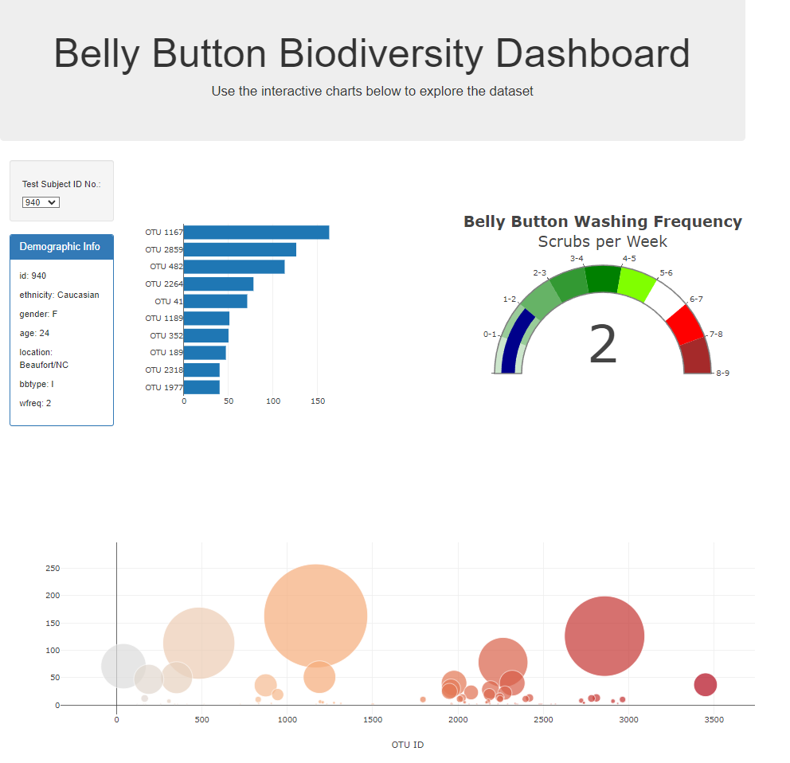

# belly-button-challenge

For this challenge, the task was to compose code for the Belly Button Challenge, an interactive web visualization project using D3 and Plotly to create an interactive dashboard. The visualizations are based on the dataset provided by the bootcamp in the samples.json file. Starter HTML was utilizied in the index.html file.

## Description

The web visualization dashboard shows:

- A bar chart showing the top 10 OTU IDs and their corresponding sample values.
- A bubble chart displaying the relationship between OTU IDs and sample values.
- A gauge chart representing the weekly washing frequency.
- Demographic information for each test subject when selected

The visualizations are dynamically updated based on user selection from the Test Subject ID No. dropdown menu.

This is the resulting output:

